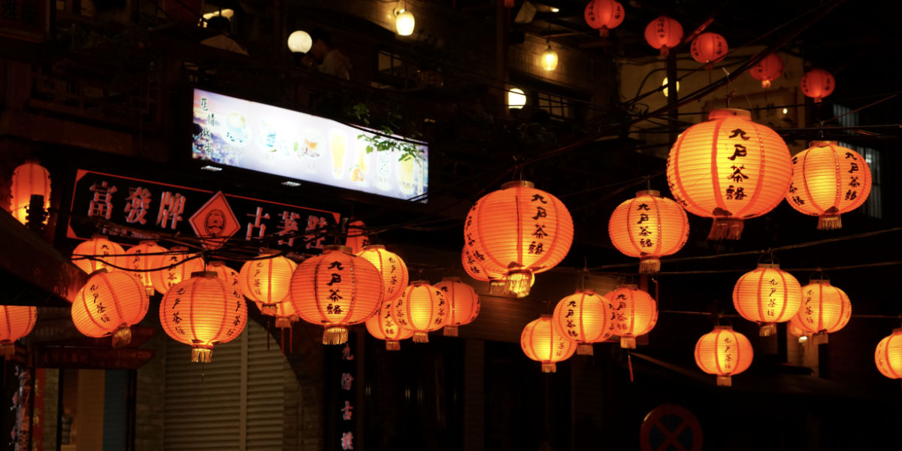
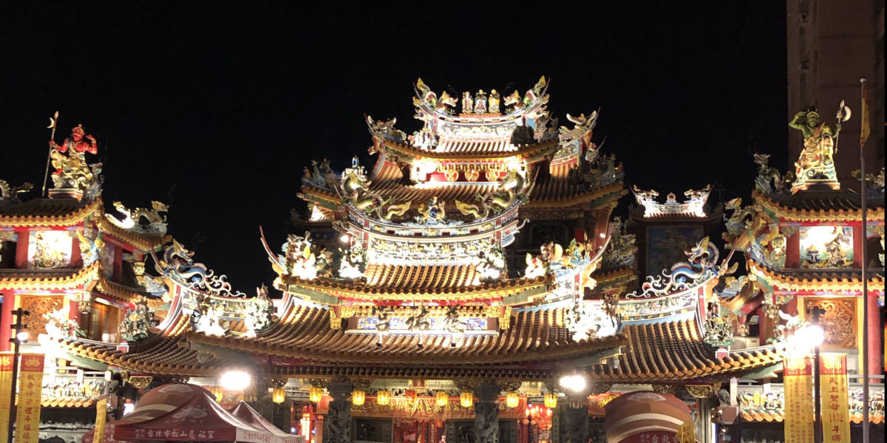

## 初めての海外
30も半ばになって初めての海外に行ってきました。元々台湾は行ってみたい国の一つでして、色々あって実に6年越しの念願の旅行になりました。九份と台北市内を中心に観光しましたので少し感想を残していこうと思います。

## 一日目
今回は1泊2日の旅行なので始発で空港に向かいます。日本を8時半に出て台湾桃園国際空港には現地時間の11時着。今回はスターフライヤーを利用しました。機内食は思っていた以上に美味しかったです。ビールが無料で飲めるの少し驚きました。

到着後は両替し、台北101に向かいます。今回は移動についてはあまり下調べしていなかったので、案内所的なところで少し日本語がわかる方に台北101に行きたいと伝えると、丁寧に教えてもらえました。台北MRTに乗って行くと良いとのことなので、Suicaのようにチャージ出来るカードを購入しそれを利用しました。

その後台北101に着くまでに奥さんと一悶着ありましたが無事到着。展望台に登るには少々値段が高い気もしましたがせっかくなので登りました。登る前に写真撮影をし、合成写真を購入することもできるようです。台北市内を一望できるのでとりあえずおすすめです。

### 台北101から九分へ

その後夕方から[VELTRA](https://www.veltra.com/jp/)の九分ツアーを申し込んでいたので、集合場所のホテルに向かいます。本当は台北101で小籠包を食べたかったですが、待ち時間がすごいことになっていたので、2日目に食べることに。

ホテルに着くと日本人がたくさんいてバスに乗って九分に向かいます。名前が呼ばれて指定されたバスに乗ってきますが、ガイドさんの説明やいろいろな話を聞いて眠気が限界に達してウトウト。途中観光ばすが九分の前まではいけないということでシャトルバス的なものに乗り換えます。九份到着後は本日二度目の奥さんと一悶着した後、写真でよく見る夜景スポットを探して足場が不安定な階段を登っていきます。

写真で見るときれいな場所でしたが、兎にも角にも人が多くて階段を登って行くのも一苦労です。あとは登っている最中に不意に漂ってくる下水の匂い。個人的には一度は行った方がいいとは思いますがリピートはなさそうです。犬もウヨウヨしています。

### 饒河街夜市

その後は饒河街夜市まで送迎してもらい現地解散もしくはどこか忘れましたが駅まで送迎してもらえます。私たちは現地解散を選択し夜市に向かいました。夜市も兎に角人が多くストレスが募っていきます。奥さんはトマト飴？を食べ、私は牡蠣のオムレツみたいなものを食べたかったですが、なかなか店が見つからず、麺を出しているお店で食べました。

ただそこでわかったことですが、私は八角の匂いがダメと言うこと。体が受け付けない。幸い注文したジャージャー麺はあまり八角の匂いがせず美味しく食べれました。夜市の料理は値段が安いので混んでいるところで食べるのがはずれを引かなくて良いような気がします。その後は疲れていたので夜市ではあまり滞在せずにホテルに向かいます。

その後はホテルのチェックイン後、足つぼマッサージに駆け込みました。台湾のマッサージ師は国家資格がいるそうで日本ではやったことはありませんが気持ち良く値段もお手頃で良いと思いました。

思ったより長くなったので、次回があれば次回に続きます😃